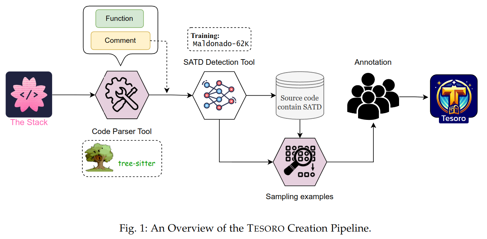

<div align="center">


# Improving the detection of technical debt in Java source code with an enriched dataset

<p align="center">
  
</p>

[](https://opensource.org/licenses/MIT) [](https://huggingface.co/datasets/Fsoft-AIC/the-vault-function) []() 

</div>

# Introduction
*Technical debt (TD)* arises when developers choose quick fixes over well-designed, long-term solutions. Self-Admitted Technical Debts (SATDs) are a type of TD where developers explicitly acknowledge shortcuts in code comments. Most existing approaches focus on analyzing these comments, often overlooking the source code itself. This study bridges the existing gap by developing the first dataset that associates SATD comments with their respective source code, and introduces a novel approach where the input consists solely of source code.

# $\text{Tesoro}$
We propose a novel dataset and construction pipeline (Fig. 1) to obtain informative samples for technical debt detection.



## Data Usage
$\text{Tesoro}$ contains two datasets:

- $\text{Tesoro}_{comment}$: comments serve as the input source, to support SATD-related tasks. Source code can be used as additional context.

- $\text{Tesoro}_{code}$: supports detecting technical debt in source code without relying on natural language comments.

<br>

**Load dataset on Huggingface:** We publish [ $\text{Tesoro}_{comment}$ ](https://huggingface.co/datasets/NamCyan/tesoro) and [ $\text{Tesoro}_{code}$ ](https://huggingface.co/datasets/NamCyan/tesoro) on Huggingface Dataset Hub 🤗


```python
from datasets import load_dataset

# Load Tesoro comment
dataset = load_dataset("NamCyan/tesoro_comment")

# Load Tesoro code
dataset = load_dataset("NamCyan/tesoro_code")
```

## Data for Experiments

The data utilized for training the SATD detector, performing k-fold evaluation, and answering the research questions is detailed in [Data for Experiments](data/README.md).


# Experiment Replication

We answer three research questions:

- **RQ1:** Do the manually classified comments contribute to an improvement in the detection of SATD?

- **RQ2:** Does the inclusion of source code help to enhance the detection of technical debt?

- **RQ3:** What is the accuracy of different pre-trained models when detecting TD solely from source code?

To reproduce the results of our experiments, see [Training](training/README.md) for more details.

<!-- ## Contact us
If you have any questions, comments or suggestions, please do not hesitate to contact us.
- Website: [fpt-aicenter](https://www.fpt-aicenter.com/ai-residency/)
- Email: support.ailab@fpt.com -->

# Citing us

If you're using Tesoro, please cite using this BibTeX:

```bibtex
@article{nam2024tesoro,
  title={Improving the detection of technical debt in Java source code with an enriched dataset},
  author={Hai, Nam Le and Bui, Anh M. T. Bui and Nguyen, Phuong T. and Ruscio, Davide Di and Kazman, Rick},
  journal={},
  year={2024}
}
```

# License
[MIT License](LICENSE)