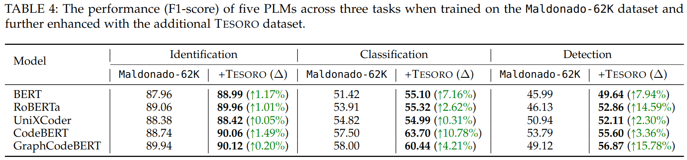
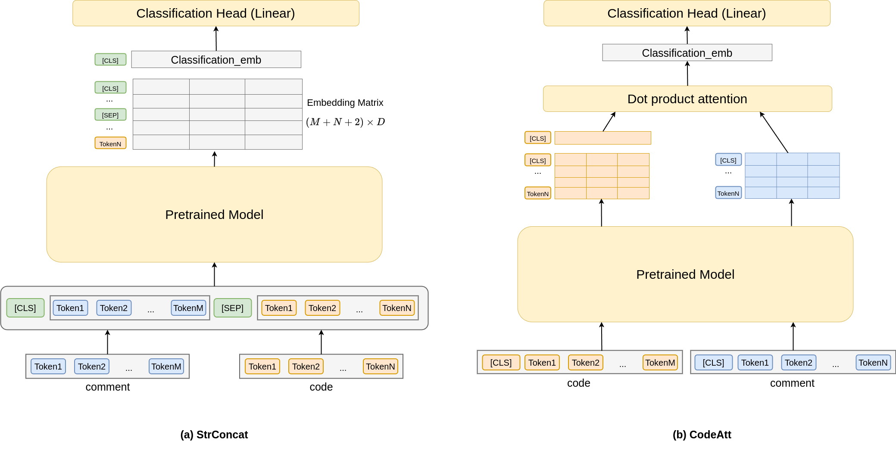
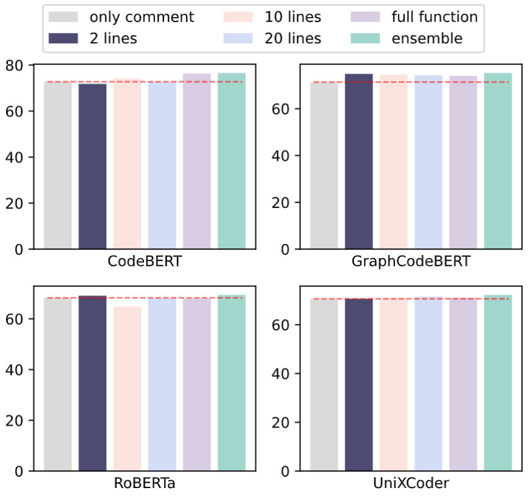

# How to reproduce our results?


## RQ1: Do the manually classified comments contribute to an improvement in the detection of SATD?

We train each model using [Maldonaldo](https://github.com/maldonado/tse.satd.data) dataset and with extra Tesoro data. We then evaluate the performance improvement achieved by integrating the Tesoro data.


### Training scripts 
See more in [scripts/RQ1](scripts/RQ1)

```bash
MODEL_SHORT_NAME=codebert-base
MODEL_NAME=microsoft/codebert-base
TASK={detection|classification|identification}

python3 cross_validation.py \
--seed 0 \
--model_short_name $MODEL_SHORT_NAME \
--model_name_or_path $MODEL_NAME \
--train_file ../data/kfolds/maldonado62k \
--output_dir ../results/maldonado62k/$MODEL_SHORT_NAME-satd-$TASK \
--text_column_names comment \
--label_column_name classification \
--metric_for_best_model f1 \
--metric_name f1 \
--max_seq_length 256 \
--per_device_train_batch_size 128 \
--gradient_accumulation_steps 1 \
--learning_rate 2e-5 \
--num_train_epochs 10 \
--do_train \
--do_predict \
--load_best_model_at_end \
--evaluation_strategy steps \
--eval_steps 500 \
--save_steps 500 \
--save_total_limit 1 \
--overwrite_output_dir \
--cross_validation \
--fp16 \
# --bin_classification \ # Use for SATD identification scenario
# --ignore_label WITHOUT_CLASSIFICATION \ # Use for SATD classification scenario
# --extra_file ../data/tesoro_as_extra_data.json \ # Use for incoporating Tesoro
```

### Results



## RQ2: Does the inclusion of source code help to enhance the detection of technical debt?

We train the model exclusively on **comment** and assess its performance when incorporating **source code** information through different contexts (e.g. *2_line_context* or *full function*) and integration techniques (Figure below) in SATD detection scenario.

<br>




### Training scripts 
See more in [scripts/RQ2](scripts/RQ2)

```bash
MODEL_SHORT_NAME=codebert-base
MODEL_NAME=microsoft/codebert-base
CODE_CONTEXT={code_context_2|code_context_10|code_context_20|code}
TECHNIQUE=concat

python3 cross_validation.py \
--seed 0 \
--model_short_name $MODEL_SHORT_NAME \
--model_name_or_path $MODEL_NAME \
--train_file ../data/kfolds/tesoro_comment \
--output_dir ../results/tesoro_comment/$MODEL_SHORT_NAME-$CODE_CONTEXT-$TECHNIQUE\
--text_column_names comment,$CODE_CONTEXT \
--label_column_name classification \
--metric_for_best_model f1 \
--metric_name f1 \
--max_seq_length 256 \
--max_query_length 512 \
--per_device_train_batch_size 32 \
--gradient_accumulation_steps 1 \
--learning_rate 2e-5 \
--num_train_epochs 20 \
--do_train \
--do_predict \
--load_best_model_at_end \
--evaluation_strategy steps \
--eval_steps 100 \
--save_steps 100 \
--save_total_limit 1 \
--overwrite_output_dir \
--cross_validation \
--fp16 \
```

To run ensemble prediction: `python3 ensemble.py`

### Results

<div align='center'>

</div>

## RQ3: What is the accuracy of different pre-trained models when detecting TD solely from source code?

We utilize only **source code** functions as input and require various pre-trained language models (PLMs) with detecting multiple types of technical debt (TD) within the code (multi-label classification problem).

### Training scripts

```bash
MODEL_SHORT_NAME=codebert-base
MODEL_NAME=microsoft/codebert-base

python3 cross_validation.py \
--seed 0 \
--model_short_name $MODEL_SHORT_NAME \
--model_name_or_path $MODEL_NAME \
--train_file ../data/kfolds/tesoro_code \
--output_dir ../results/tesoro_code/$MODEL_SHORT_NAME \
--text_column_names cleancode \
--label_column_name label \
--metric_for_best_model f1 \
--metric_name f1 \
--max_seq_length 512 \
--max_query_length 512 \
--per_device_train_batch_size 32 \
--gradient_accumulation_steps 1 \
--learning_rate 2e-5 \
--num_train_epochs 20 \
--do_train \
--do_predict \
--load_best_model_at_end \
--evaluation_strategy steps \
--eval_steps 100 \
--save_steps 100 \
--save_total_limit 1 \
--overwrite_output_dir \
--cross_validation \
--fp16 \
# arguments to train LLMs
# --is_llm \
# --lora_config_path lora_config/lora_config.yaml \
# --low_cpu_mem_usage \
# --device_map auto \
```

When finetuning **LLMs** (or Decoder-based models), we apply a instruction template for the input as below:

```text
Task: Analyze the provided code the provided code to identify technical debts, which can be categorized into the following four types:\\

DESIGN: indicate misplaced code, lack of abstraction, long methods, poor implementation, workarounds or a temporary solution.
IMPLEMENTATION: incompleteness of the functionality in the method, class or program
DEFECT: bugs or errors in the code that affect functionality.
TEST: express the need for creation or improvement of the current set of tests.
If the code does not exhibit any of these types of technical debt, respond with NonTD.
 
Code to Analyze: {code}

Answer: 
```

### Results


| Model        | Model size | EM                | F1                |
|:-------------|:-----------:|:------------------:|:------------------:|
| [CodeBERT](https://huggingface.co/microsoft/codebert-base)     | 125M       | 38.28             | 43.47             |
| [UniXCoder](https://huggingface.co/microsoft/unixcoder-base)    | 125M       | 38.12             | 42.58             |
| [GraphCodeBERT](https://huggingface.co/microsoft/graphcodebert-base)| 125M       | *39.38*           | *44.21*           |
| [RoBERTa](https://huggingface.co/FacebookAI/roberta-base)      | 125M       | 35.37             | 38.22             |
| [ALBERT](https://huggingface.co/albert/albert-base-v2)       | 11.8M      | 39.32             | 41.99             |
| [PLBART](https://huggingface.co/uclanlp/plbart-base)       | 140M       | 36.85             | 39.90             |
| [Codet5](https://huggingface.co/Salesforce/codet5-base)       | 220M       | 32.66             | 35.41             |
| [CodeT5+](https://huggingface.co/Salesforce/codet5p-220m)      | 220M       | 37.91             | 41.96             |
| [TinyLlama](https://huggingface.co/TinyLlama/TinyLlama_v1.1_math_code)    | 1.03B      | 37.05             | 40.05             |
| [DeepSeek-Coder](https://huggingface.co/deepseek-ai/deepseek-coder-1.3b-base) | 1.28B    | **42.52**         | **46.19**         |
| [OpenCodeInterpreter](https://huggingface.co/m-a-p/OpenCodeInterpreter-DS-1.3B)       | 1.35B             | 38.16             | 41.76             |
| [phi-2](https://huggingface.co/microsoft/phi-2)        | 2.78B      | 37.92             | 41.57             |
| [starcoder2](https://huggingface.co/bigcode/starcoder2-3b)   | 3.03B      | 35.37             | 41.77             |
| [CodeLlama](https://huggingface.co/codellama/CodeLlama-7b-hf)    | 6.74B      | 34.14             | 38.16             |
| [Magicoder](https://huggingface.co/ise-uiuc/Magicoder-S-DS-6.7B)    | 6.74B      | 39.14             | 42.49             |
